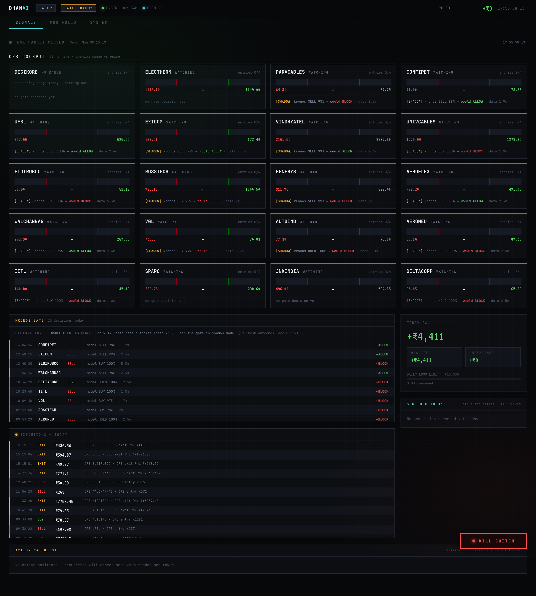
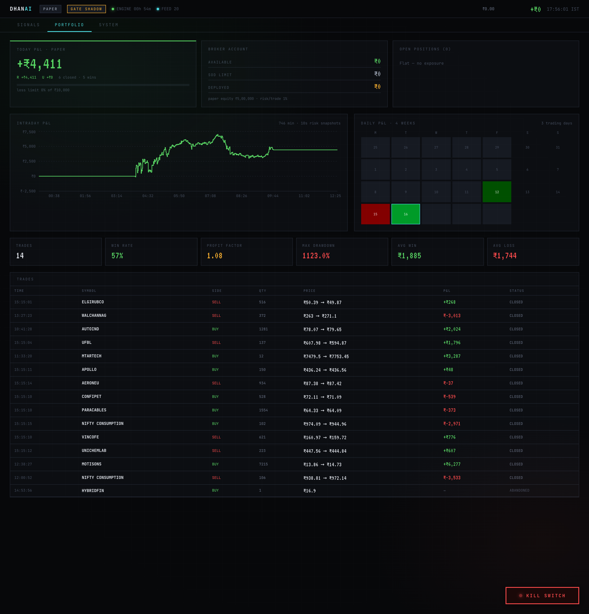
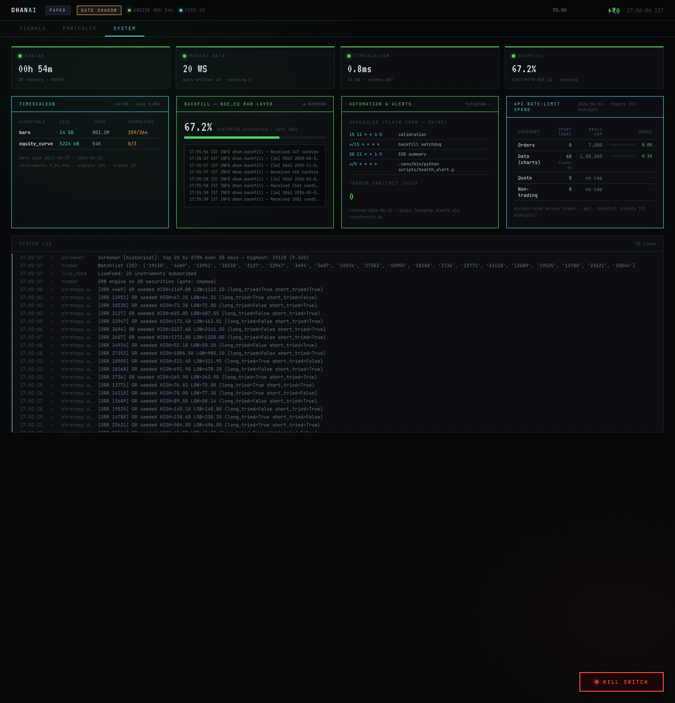

# Tessera — Algorithmic Trading Platform for NSE

*Status: paper trading live (2026-06-16) · Kronos gate in shadow mode · historical backfill ~67% · CI green*

A self-hosted intraday trading platform for NSE (National Stock Exchange of India) equities, built on the [DhanHQ v2 API](https://dhanhq.co/docs/v2/). It runs a rule-based Opening Range Breakout strategy filtered through [Kronos](https://github.com/shiyu-coder/Kronos), an OHLCV foundation model (AAAI 2026), with TimescaleDB as the single source of truth for market data, orders, and positions.

The design priority is **evidence before exposure**: paper trading is the hard default, the AI gate runs in shadow mode until calibration proves it adds value, and live trading is gated on a 2-year backtest with realistic Indian cost modelling.

> ⚠️ **Disclaimer:** educational and research software. Algorithmic trading involves substantial financial risk. Always start in paper mode. The authors are not responsible for trading losses.

---

## Dashboard

The `dhan-api` process serves a React dashboard (Signals · Portfolio · System) at `:8765`, read-only and mobile-friendly. Live captures from a paper session:

| Signals | Portfolio | System |
|---|---|---|
|  |  |  |

*Signals — ORB cockpit (per-security range ladders), executions feed, Kronos gate verdicts, Today P&L. Portfolio — equity curve, calendar P&L, trade table, win-rate/profit-factor metrics. System — services health, TimescaleDB stats, backfill progress, automation/alerts, and the cross-process **API rate-limit spend** panel (FEAT-02).*

---

## Architecture

Two independent processes share nothing but the database and a heartbeat file — an analytics query can never delay an order.

```
                      Dhan WebSocket feed          Dhan REST API
                             │                          │
  ┌──────────────────────────▼──────────────────────────▼─────────────┐
  │  dhan-trader  (apps/trader.py — systemd)                          │
  │                                                                   │
  │  LiveFeed ──► BarBuilder ──► bars hypertable   (1-min bars → DB)  │
  │      │                                                            │
  │      └──► StrategyRunner ──► ORB (pure signal logic)              │
  │                 │                                                 │
  │                 ├── KronosGate (shadow) ──► signals table         │
  │                 ├── RiskEngine (sizing, daily-loss halt,          │
  │                 │               kill-switch — single owner)       │
  │                 └── Paper | Live executor ──► Portfolio (DB)      │
  │                                                                   │
  │  exports run/trader_heartbeat.json every 5 s                      │
  └───────────────────────────────────────────────────────────────────┘
                             │ heartbeat + DB (read-only)
  ┌──────────────────────────▼────────────────────────────────────────┐
  │  dhan-api  (apps/api.py — systemd)                                │
  │  React dashboard + ~30 REST endpoints on :8765                    │
  │  Route handlers decomposed into apps/routes/ (heartbeat,          │
  │  db, market, system) — 16-thread executor prevents file           │
  │  serving from starving behind slow DB queries                      │
  └───────────────────────────────────────────────────────────────────┘

  TimescaleDB (separate EC2, private subnet)
  bars · ticks · orders · fills · trades · positions · equity_curve
  signals · runs · instruments · api_usage  (5 hypertables + compression)
```

**Key design decisions**

| Decision | Why |
|---|---|
| One engine, swappable executors (Paper / Live / Backtest) | Strategies are mode-blind; paper → live is a config flip, not a code path |
| Portfolio persisted to DB, reconciled on boot | A process restart never orphans a position; in live mode the broker is cross-checked as source of truth |
| Kronos gate in **shadow mode** | Every verdict is logged with features for calibration, but never blocks a trade until the data says it should |
| Kronos is fail-open | A model error must never stop the rule-based strategy from managing risk |
| Backtester replays the **same** strategy class | Next-bar-open fills (no lookahead), full Indian intraday cost stack, point-in-time universe |
| TimescaleDB self-hosted | Backtests scan millions of bars for free; no per-query billing |
| Cross-process API spend accounting | `core/api_usage.py` UPSERTs per-category call deltas from every process (trader / api / backfill) into the `api_usage` table so the dashboard shows true daily spend across all processes |
| Terraform remote state | `infra/` uses an S3 backend (bucket injected via gitignored `backend.hcl`) so the live infra state is never local-only |

---

## What's inside

```
apps/
  trader.py            Trading process — feed, strategies, risk, execution
  api.py               Dashboard process — REST API + static React build
  routes/
    heartbeat.py       Fast heartbeat-file handlers (no DB): status, risk, killswitch
    db.py              DB-backed handlers: equity, signals, trades, gate stats
    market.py          Live Dhan data: funds, positions, LTP, watchlist
    system.py          Ops handlers: logs, backfill status, system health
engine/
  execution.py         PaperExecutor (slippage-modelled) / LiveExecutor (fill-confirmed)
  portfolio.py         DB-persisted positions, boot + broker reconciliation
  risk.py              Position sizing (fractions of equity), daily/weekly loss halt,
                       persistent halt state, kill-switch
  bar_builder.py       WebSocket ticks → 1-minute bars → DB
  runner.py            Polling loop per security: gate → size → risk → execute
strategies/
  orb.py               Opening Range Breakout — pure, synchronous, IO-free
ml/
  kronos_gate.py       Shadow/enforcing AI gate; persists every verdict to signals
  calibration.py       Realized-outcome filling + gate-value report (the re-arm criterion)
research/backtest/     Event-driven backtester: engine, costs, universe, report,
                       kronos_gate adapter for the three-way comparison
core/
  client.py            DhanClient with rate limiter (100K calls/day quota)
  api_usage.py         Cross-process API spend accounting (FEAT-02)
  token_manager.py     Atomic token cache — stops concurrent processes fighting over .env
  live_feed.py         WebSocket feed (STRING SecurityId required — ints silently no-stream)
  kronos_signal.py     KronosSignalEngine: 5-min aggregation, T=0.6, N=10, scorer v2
  kronos_scanner.py    Batch pre-session Kronos scoring of the watchlist
  nse_screener.py      ATR%-ranked screener: ₹50 price floor, 50K volume floor, EQUITY validation
  instruments.py       Scrip-master lookup and validation
  journal.py           Trade journalling to DB
  notify.py            Telegram alerts (plain bot API — ₹0/month, no LLM)
  watchlist.py         Cached per-session watchlist with on-demand refresh
  charges.py           F&O options cost calculator (separate from backtest costs)
scripts/
  build_clean_db.py    M2.5: survivorship-safe clean replica for backtesting
  health_alert.py      Sends Telegram alert if trader heartbeat goes stale
  eod_summary.py       End-of-day P&L and gate summary to Telegram
  finetune.py          Kronos fine-tune entry point (spot GPU, date-split)
  prepare_kronos_dataset.py  Parquet export for fine-tuning
dashboard/             React 18 + Vite — Signals / Portfolio / System tabs, mobile-friendly
infra/                 Terraform (VPC, 2× EC2, EIP, S3, SSM, IAM; remote state via S3 backend)
                       + systemd units (dhan-trader, dhan-api)
alembic/               Schema migrations (001 → 007)
backfill.py            Historical OHLCV backfill CLI (checkpointed, rate-limited)
config.py              Single typed pydantic-settings object — no os.getenv anywhere else
docs/
  Architecture.md      Process model, engine internals, data flow, design rationale
  Strategies.md        ORB rules, Kronos gate (scorer v2), risk model, calibration loop
  Backtesting.md       Backtester design, cost model, CLI usage, three-way study
  NFRs.md              Non-functional requirements (latency, availability, data retention)
  M6-Auth-Design.md    Auth layer design (not yet implemented — mitigation: dashboard_token)
  Live-Readiness-Checklist.md  Pre-live gate: what must pass before PAPER_TRADING=false
  QA-Analysis-Report.md  Risk register, test gaps, live-path bugs
  CONTRIBUTING.md      Contribution guide
LICENSE                MIT
tests/                 195 tests across 27 files, run in CI on every push
```

---

## CI / CD

CI runs on **Python 3.11**, both **x86** and **ARM** (ubuntu-24.04-arm), on every push to `main` and every pull request:

- **test** — `pytest` with coverage (threshold 41%), `--cov-report=term-missing`
- **ruff** — lint check on all Python files

**CodeQL** (GitHub default code scanning, Actions + Python + JS/TS) and **Dependabot** are both active and currently clean — the dashboard's npm advisories (vite/@babel) and the workflow-permissions findings were triaged and fixed. A `.pre-commit-config.yaml` (ruff + `detect-private-key` + large-file guard) runs locally.

---

## The strategy loop

```
Market open → ATR% screener picks top-N volatile NSE equities
  (₹50 min price · 50K min avg volume · validated against the scrip master)
  → ORB locks the 9:15–9:30 opening range per security
  → breakout/breakdown → Kronos gate scores a 30-bar forecast
       shadow mode: verdict logged, trade proceeds regardless
       enforcing mode: confidence < 0.4 blocks the entry
  → RiskEngine sizes the position from stop distance (0.5% equity risk,
    20% notional cap, 1% ADV liquidity cap) and can halt the session on
    a daily (2%) or weekly (5%) loss limit
  → executor fills (paper: ref price ± 2 bps slippage · live: broker fill confirmed)
  → exits: target (1.5× opening range) · stop (range edge ± 0.2% buffer) · 15:15 EOD square-off
  → every order, fill, trade, equity snapshot, gate verdict, and API call lands in the DB
```

---

## Quick start

### Local development

```bash
git clone https://github.com/armaanfarshori/dhan_algo && cd dhan_algo
python3.11 -m venv .venv && source .venv/bin/activate
pip install -r requirements.txt

cp .env.example .env            # set DHAN_CLIENT_ID + DHAN_ACCESS_TOKEN
docker compose up -d            # throwaway local TimescaleDB
alembic upgrade head

python backfill.py --instruments        # scrip master (~224K instruments)

# Backfill note: the full NSE_EQ history (--nse-eq --all --from 2021-06-01)
# takes DAYS and is rate-limited to Dhan's 100K calls/day quota.
# For a quick smoke test, fetch one security — takes seconds:
#   python backfill.py --ids 2885
# Run python backfill.py --help for all options.
python backfill.py --ids 2885           # single security, fast smoke test

# Kronos model cache note: KRONOS_OFFLINE=true by default (reads local
# HuggingFace cache only — no network). On a fresh machine with no cache
# the model will fail to load. Prime the cache once:
#   KRONOS_OFFLINE=false python -m apps.trader   (downloads ~100 MB from HF)
# Models: NeoQuasar/Kronos-small + NeoQuasar/Kronos-Tokenizer-base
# After the first run the cache is used automatically on subsequent starts.
# The gate is fail-open — a missing model never blocks trades, but Kronos
# scoring will not work until the cache is primed.
python -m apps.trader                   # paper mode by default
python -m apps.api                      # dashboard → http://localhost:8765
pytest -q                               # 195 tests
```

### Backtesting

```bash
python -m research.backtest --from 2026-05-01 --to 2026-06-01 --n 5
python -m research.backtest --from 2026-05-01 --to 2026-06-01 --gate kronos --json out.json
```

### Production (AWS)

```bash
cd infra
cp backend.hcl.example backend.hcl   # fill in the real S3 bucket name (from dhan_aws_access/)
terraform init -backend-config=backend.hcl
terraform apply
# outputs: agent Elastic IP (whitelist in Dhan DevPortal — order APIs only)
# systemd units in infra/systemd/ run dhan-trader + dhan-api
```

See [docs/Setup-Guide.md](docs/Setup-Guide.md) for the full walkthrough and [docs/Operations-Runbook.md](docs/Operations-Runbook.md) for day-2 operations.

---

## Documentation

| Page | Contents |
|---|---|
| [docs/Home.md](docs/Home.md) | Overview, current status, roadmap |
| [docs/Architecture.md](docs/Architecture.md) | Process model, engine internals, data flow, design rationale |
| [docs/Setup-Guide.md](docs/Setup-Guide.md) | Local dev and AWS deployment, step by step |
| [docs/Configuration.md](docs/Configuration.md) | Every config field with defaults and safety notes |
| [docs/Strategies.md](docs/Strategies.md) | ORB rules, Kronos gate (scorer v2), risk model, calibration loop |
| [docs/Backtesting.md](docs/Backtesting.md) | Backtester design, cost model, CLI usage, three-way study |
| [docs/API-Reference.md](docs/API-Reference.md) | REST endpoints with response shapes |
| [docs/NFRs.md](docs/NFRs.md) | Non-functional requirements |
| [docs/M6-Auth-Design.md](docs/M6-Auth-Design.md) | Auth layer design (not yet implemented) |
| [docs/Live-Readiness-Checklist.md](docs/Live-Readiness-Checklist.md) | Gate items before switching to live |
| [docs/Operations-Runbook.md](docs/Operations-Runbook.md) | Deploy, monitor, recover — the ops playbook |
| [CONTRIBUTING.md](CONTRIBUTING.md) | Contribution guide |

---

## Safety model

1. **`PAPER_TRADING=true` is the default.** Going live requires editing `.env` *and* `ALLOW_LIVE_TOGGLE=true` *and* a process restart — live is never one HTTP request away.
2. **The RiskEngine owns the kill-switch.** All orders route through it; `POST /api/killswitch` writes a flag file the trader's risk loop picks up within ~10 seconds. Nothing bypasses it. Mutating POST endpoints require `DASHBOARD_TOKEN` (shared-secret HMAC check via `X-Dashboard-Token` or `Authorization: Bearer` header; fail-open if the token is unset so a misconfiguration never locks out the kill-switch).
3. **Kronos is fail-open.** Gate errors never block trades — the rule-based exits always run.
4. **No live trading until the backtest passes** on 2+ years of real NSE data with realistic costs (brokerage, STT, NSE fees, GST, adverse slippage).
5. **Dhan has no sandbox.** Every non-paper API call hits production infrastructure. The IP whitelist applies to order placement only.
6. **EOD square-off is unconditional** — it does not depend on strategy state, so a mid-session restart can never leave a position unmanaged overnight.
7. **Risk limits are fractions of equity, not absolute rupees** — paper rehearses the same geometry live will use; live mode additionally halves every limit via `live_risk_scale`.
